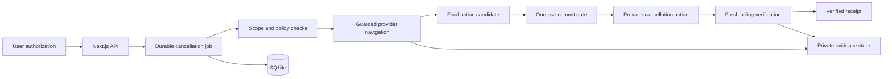

# CleanBreak

CleanBreak is a guarded subscription-cancellation system that turns a user-authorized cancellation into a durable workflow with explicit action control and independent billing verification.

**User:** someone canceling a subscription they own or control.  
**Input:** a specific subscription, authenticated provider session and explicit cancellation authorization.  
**Output:** a verified cancellation state and durable receipt backed by fresh billing evidence.

The project focuses on one core principle: **execution and verification are separate responsibilities**. A cancellation click is treated as an action attempt; CleanBreak independently checks the provider's billing state before recording a verified outcome.

## Live Solari & Miro demo

[](docs/media/miro-cancellation.mp4)

[Watch the full Miro walkthrough](docs/media/miro-cancellation.mp4) ·
[View the recorded outcome](docs/media/proof-summary.json)

The walkthrough shows the real Solari Desktop flow for a Miro Business Trial cancellation. CleanBreak navigates the provider flow, rejects retention alternatives, reaches the final cancellation control through a separate commit gate, and then verifies the resulting billing state through a fresh Billing-page observation.

## Why it matters

Account automation becomes much more demanding when an action changes billing or access. A useful system needs more than browser navigation: it needs scoped authority, durable state, protection against duplicate destructive actions, crash-aware recovery and evidence that the requested change actually took effect.

CleanBreak treats those concerns as first-class parts of the product rather than wrapping a browser agent around a click sequence.

## Architecture



The workflow separates navigation, authority, final dispatch and verification so no single browser observation controls the entire outcome.

## How it works

1. The user selects a subscription and explicitly authorizes cancellation.
2. The server builds an immutable authorization scope from trusted provider and subscription configuration.
3. A durable job records the workflow state before navigation begins.
4. The provider adapter follows recognized cancellation steps while preserving the authorized target and terms.
5. Navigation returns a final-action candidate instead of directly executing the destructive action.
6. A separate commit gate revalidates identity, target and current terms.
7. The one-use dispatch grant authorizes the final action.
8. Verification opens a fresh provider billing observation and checks the current renewal state.
9. A receipt is created from verified before/after evidence and retained workflow state.

## Safety model

```text
Explicit authorization
    -> guarded navigation
    -> fresh final revalidation
    -> durable one-use claim
    -> final action
    -> independent billing verification
    -> verified receipt
```

Authority stays server-side throughout the flow. Provider text, page content, model output and client-supplied fields do not expand the authorized action.

The final-action boundary is intentionally separate from the navigator. Navigation can identify the candidate action, but only the commit path can consume the one-use authorization and dispatch it.

## Failure and recovery behavior

CleanBreak is built so interrupted or ambiguous execution does not turn into repeated destructive actions.

The durable workflow records state before dispatch, keeps authorization use separate from browser navigation, and routes uncertain execution toward verification rather than automatically replaying the final action. Concurrency, idempotency and worker recovery all operate against the same persisted job state.

Recovery logic also keeps provider authentication, job state and private evidence as distinct concerns. That allows the system to reconnect to an authenticated browser session without rewriting historical job state or treating browser cleanup as a new authorization.

## Independent verification

The Miro path verifies cancellation with a fresh Billing-page observation in the authenticated Chrome profile.

The verifier checks recognized billing state and provider responses rather than trusting a success toast, dialog copy or the navigator's own interpretation. Verification is therefore a separate read path with its own evidence and identity checks.

The current provider integration uses deterministic DOM extraction for the cancellation flow and billing verification. Local screenshots can also be retained as private evidence for target-stability checks.

## Design tradeoffs

- **Independent verification over trusting execution acknowledgements:** adds an extra provider read after the action, but gives the system a stronger source of truth for the final state.
- **Durable one-use authority over stateless retries:** requires explicit state transitions and locking, but makes destructive execution inspectable across concurrency and recovery.
- **Deterministic provider adapters over unrestricted browser autonomy:** provider-specific structures take more engineering, while keeping action selection and billing interpretation tightly bounded.
- **Server-built authorization scope over client-provided action terms:** the UI remains simple while the trusted backend owns the provider, account, subscription and financial scope.
- **Private evidence storage over public browser artifacts:** recordings and provider evidence stay separated from source control while still supporting audit and verification workflows.
- **Local provider execution plus a fictional regression provider:** the Miro integration exercises the real browser path, while StreamMax provides a repeatable end-to-end environment for development and testing.

## Current provider paths

### Miro

The live provider adapter targets the Miro Business Trial cancellation flow through Solari Desktop. The path includes provider navigation, retention-offer rejection, cancellation selection, reason handling, final-action gating and fresh billing verification.

See [Miro navigation and verification](docs/no-image-verification.md).

### StreamMax

StreamMax is a fictional provider used for repeatable local end-to-end checks. It exercises the same authorization, state, commit, verification and receipt workflow without depending on an external account.

## Run the local end-to-end check

Requires Node.js 22.18+ and npm.

```bash
npm install
npm run profile:install
npm run test:one-click
```

The local workflow uses an isolated database and Chromium environment and produces a verified receipt through the same application path used by the product.

## Open the web app

```bash
npm run dev
```

Open the address printed by Next.js, typically `http://localhost:3000`.

Use **Local one-click test: no external account > StreamMax** to exercise the complete flow from the dashboard.

## Validation

The automated suite covers the behavior that matters most for destructive browser automation:

- authorization scope
- concurrent requests
- idempotent job handling
- crash recovery
- target and term revalidation
- authentication-profile protection
- provider navigation
- final-action dispatch
- billing verification
- receipt creation
- private browser transport and cleanup

Run the project checks through the repository's npm scripts and test suite.

## Technology

**TypeScript · Next.js · Playwright · SQLite · Solari Desktop · Browser Automation**

Next.js provides the operator UI and API routes. TypeScript implements the cancellation state machine, authorization and provider adapters. SQLite stores durable jobs, authorizations and receipts. Playwright connects to the authenticated browser environment used by the provider integration.

## Repository map

```text
app/                        # dashboard, APIs and receipt pages
components/                 # UI components
lib/cancellations/          # jobs, policy, provider flow and verification
lib/desktop/                # desktop/browser connection layer
lib/solari/                 # Solari sessions and profile lifecycle
lib/verification/           # verification helpers
lib/receipts/               # receipt storage
lib/db.ts                   # SQLite access
lib/db/migrations/          # persisted schema
tests/                      # regression and workflow tests
scripts/                    # diagnostics and command-line utilities
examples/                   # standalone SDK examples
docs/                       # architecture, security and provider-flow docs
```

## Key files

- [Product contract](PRD.md)
- [Source guide](docs/code-map.md)
- [Security and trust boundaries](docs/security.md)
- [Miro navigation and verification](docs/no-image-verification.md)
- [Cancellation state machine](lib/cancellations/state.ts)
- [Authorization policy](lib/cancellations/policy.ts)
- [One-use dispatch](lib/cancellations/dispatch.ts)
- [Workflow service](lib/cancellations/service.ts)
- [Standalone SDK examples](examples/README.md)
