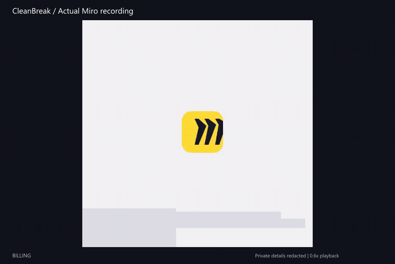

# CleanBreak

Cancel a subscription once. Independently verify that renewal stopped.

## Live Solari & Miro Demo

[](docs/media/miro-cancellation.mp4)

[Watch the full Miro walkthrough](docs/media/miro-cancellation.mp4) |
[Recorded outcome](docs/media/proof-summary.json)

This is the actual Solari Desktop recording from the completed Miro Business
Trial cancellation. Only credit-card details are blurred; the full page and
provider controls remain visible.

The recording shows execution. A separate fresh Billing-page check and reload
established the verified outcome. 

| Measured live outcome                          | Result                                        |
| ---------------------------------------------- | --------------------------------------------- |
| Verified recurring renewal avoided             | **$240/year**                           |
| Completed real subscription cancellations      | **1 Miro Business Trial**               |
| Final clicks / authorization uses              | **1 / 1**                               |
| Automatic destructive retries / unsafe actions | **0 / 0**                               |
| Independent verification                       | **Renewal OFF; cancellation scheduled** |

These are results from one completed cancellation. Annualized avoided renewal
is not cash recovered or a success-rate benchmark. Earlier failed navigation
attempts remain part of the project history.

## 2. Run the local end-to-end check

Requires Node.js 22.18+ and npm. From the repository root, install once:

```bash
npm install
npm run profile:install
```

Then run:

```bash
npm run test:one-click
```

Expected: `STREAMMAX_ONE_CLICK_OK`, one authorization, one click, zero retries
and a VERIFIED receipt with a valid digest. This uses a fictional StreamMax
subscription, an isolated local database and local Chromium. No provider keys,
Solari credits or real account are needed.

## 3. Open the web app

```bash
npm run dev
```

Open the address printed by Next.js, usually `http://localhost:3000`.
Use **Local one-click test: no external account > StreamMax** to try the flow.
Stop this server before running the isolated end-to-end check.

The dashboard separates real receipt-backed savings from fictional sample
subscriptions. A fresh clone starts with zero real savings. A local database
containing the completed Miro receipt shows **$240/year**, even after the VM is
retired. Legacy fixture savings never enter that real total.

The public walkthrough above is the completed live proof. Viewing it requires
no VM, credentials or new cancellation. Live execution remains an explicitly
configured, operator-authenticated action.

## Safety model

```text
One user authorization -> guarded navigation -> fresh final revalidation
  -> durable one-use claim -> at most one final click -> independent billing check
  -> VERIFIED + receipt | NOT_VERIFIED | INCONCLUSIVE
```

The Miro adapter follows recognized DOM structures in an authenticated Desktop.
It declines the extension and downgrade alternatives. An uncertain final click
is never retried. Verification uses fresh observations within the same Chrome
profile, including a Billing reload.

Receipts are checked before counting savings. Amounts are annualized in cents,
subscriptions are counted once and currencies are reported separately.
Private recordings, authentication state and account data stay outside Git.

## Engineering evidence

The automated suite covers authorization, concurrency, crash recovery,
profile protection, changed targets and billing verification. The Browser
benchmark below uses deterministic offline adapters. It does not measure live
Miro reliability. [Current implementation and limits](IMPLEMENTATION_STATUS.md).

<!-- BENCHMARK_RESULTS_START -->

## Measured results

Deterministic offline results from `artifacts/benchmark-results.json`.

| Measure                                  |          Result |
| ---------------------------------------- | --------------: |
| Runs                                     |  100/100 passed |
| False verified                           |               0 |
| Unsafe actions executed                  |               0 |
| Automatic destructive retries            |               0 |
| Retention resistance                     |          100.0% |
| Verification / VERIFIED receipt coverage | 100.0% / 100.0% |

<!-- BENCHMARK_RESULTS_END -->

## Code and design

- [Product requirements](PRD.md)
- [Security boundaries](docs/security.md)
- [Miro flow and verification](docs/no-image-verification.md)
- [Source guide](docs/code-map.md)
- [Standalone SDK examples](examples/README.md)

CleanBreak is a single-operator research project. One observed Miro Business Trial
flow is supported; arbitrary providers, every Miro plan and public multi-tenant
operation have not been established.
