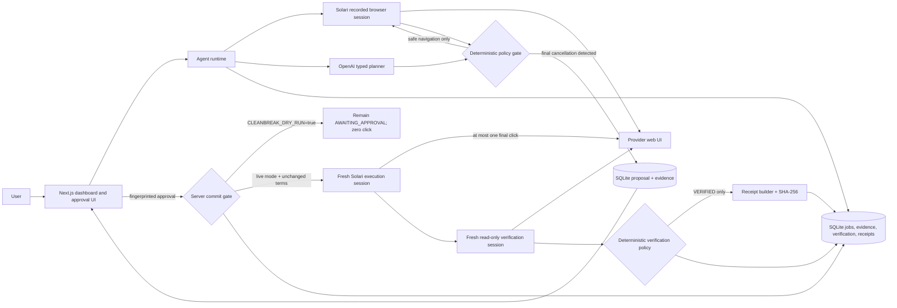

# CleanBreak

Desktop lifecycle: CleanBreak closes its own connections but does **not** pause
the shared VM when creation, manual authentication, dry-runs, or cancellation
workers finish or fail. This keeps the Solari website viewer available. Pause the
VM yourself in Solari when finished to stop compute billing. The configured
server-side idle timeout still applies; `paused: false` is expected in dry-run output.

CleanBreak is a safety-first subscription cancellation agent. It uses a recorded
Solari browser, an OpenAI planner, deterministic policy gates, explicit human
approval, independent verification, and tamper-evident receipts. The repository
also includes StreamMax, a deterministic fictional provider used to exercise the
entire workflow without touching a real account.

## One-click product path

Screenshot-model uploads are now **off by default**. The current Desktop navigation
planner therefore cannot run without separate image-sharing opt-in; do not enable
it for an operator who has refused screenshots. Verification no longer uses that
planner: `npm run desktop:verify` reads locally parsed billing DOM facts through a
private connection, with no OpenAI request or cancellation action. An authenticated,
connectable Chrome profile is still required. The current VM was found using
Chrome's default profile instead of CleanBreak's dedicated profile, so verification
remains INCONCLUSIVE and the full live cancellation is not complete. See
[screenshot-free verification and setup limitations](docs/no-image-verification.md).

The primary dashboard now creates a scoped, 15-minute one-shot authorization from
the initial Cancel button. It navigates autonomously, revalidates material terms,
atomically claims at most one final click, independently verifies future billing,
and issues a receipt only for VERIFIED. No second approval is required on this
path; legacy Browser/StreamMax approval regressions remain in the demo lab.

Start with `npm run test:one-click` for the isolated local StreamMax dashboard
test. Real Miro execution is disabled by default and has not been live-validated.
See [one-click operation, authorization and recovery](docs/one-click-product.md)
for the exact explicit live flags, operator authentication, trust limits, safe
dry-run and receipt evidence commands.

For the local web app controlling an existing, authenticated Miro Desktop, stop
the previous dev server, then run `npm run dev:live`. This explicit live-mode
launcher reads `.env`, prompts for a hidden 24+ character operator password if
needed, validates configuration locally, and passes all live flags to the actual
Next server process. It does not connect to Solari or submit a cancellation.
Open the **exact** loopback address it prints, sign in as `cleanbreak`, and use
the Miro card marked **Live cancellation**. `localhost` and `127.0.0.1` are not
interchangeable for the origin protection. The launcher disables background
startup recovery; existing job requests can still resume their persisted work.
It never writes the password to a file or puts it in command-line arguments.
`npm run dev` retains the existing safe defaults. A disabled card now says
**Live setup required**, and rejected requests display fixed, actionable errors
without exposing server/provider details. No real-provider success is implied
by starting the web server or passing local tests.

## The problem

Canceling a subscription is often a multi-screen workflow with retention offers,
ambiguous language, and a final action that can have financial consequences.
Simple browser automation is brittle, and a model should not be trusted to decide
on its own when a destructive action is safe.

## Why now

Modern browser agents can navigate unfamiliar interfaces, but useful deployment
requires a stronger contract than “the model clicked the right button.” CleanBreak
demonstrates that contract: narrow actions, deterministic enforcement, durable
approval, no automatic destructive retries, and fresh-session proof after action.

## The solution

CleanBreak observes one page at a time and asks the planner for one typed action.
A deterministic policy validates every target against the current observation,
blocks unsafe classes of action, and intercepts the final cancellation control.
Only a fingerprinted proposal can be approved. After a permitted final click, a
separate recorded browser session reads the authoritative account state before a
receipt can be issued.

## Architecture



The model proposes; it never owns authorization. Solari owns remote browser
execution and recordings. Server-side policy owns action eligibility, approval
matching, commit arming, and the no-retry rule. A fresh verifier owns the success
decision. SQLite owns the durable audit trail and receipt evidence.

## Agentic behavior

- The planner receives a bounded page observation and returns one strict typed
  decision: click, fill, select, navigate, stop, or final-cancel candidate.
- Target IDs are scoped to the latest observation; invented and stale targets fail
  closed.
- Navigation is restricted to the configured provider origin.
- The loop is bounded by step count, repeated-page detection, confidence, and
  request timeout.
- Retention rejection is allowed; retention acceptance, account deletion,
  financial commitments, unrelated actions, and external navigation are blocked.

## Safety model

The final cancellation action is never executed by the navigation loop. CleanBreak
persists the page evidence, exact target, terms, financial snapshot, and a SHA-256
approval fingerprint, then enters `AWAITING_APPROVAL`.

With `CLEANBREAK_DRY_RUN=true`—the safe default—the server refuses to create an
approval or launch an execution browser even if a valid approval form is posted.
The job stays at `AWAITING_APPROVAL`, with zero destructive clicks. In explicitly
enabled live mode, the server reopens the page in a new recorded session, checks
that exactly one eligible final target exists, compares current terms with the
approved snapshot, durably arms the commit, and permits at most one click. An
unknown outcome is never retried automatically.

## Verification

Success is not inferred from a confirmation screen or from the planner. A distinct
Solari session, using the same persisted profile, navigates to the provider account
and performs only navigation, observation, and screenshots. Deterministic rules
classify the state as `VERIFIED`, `NOT_VERIFIED`, or `INCONCLUSIVE`. Contradictory
evidence, expired login, browser errors, and session reuse cannot produce success.

## Receipts

A receipt is created only after `VERIFIED`. It contains before/after subscription
facts, execution and verification evidence, session provenance, annualized verified
savings, and a canonical SHA-256 digest. Non-verified runs never receive a success
receipt. The receipt page is optimized for both review and print/PDF export.

## Benchmark

`npm run benchmark` executes 20 adversarial scenarios five times each against
isolated in-memory databases and deterministic planner/browser adapters. It invokes
the production loop, policy, repositories, approval/commit recovery, verification,
and receipt code, while making no OpenAI or Solari API calls. The artifact at
[`artifacts/benchmark-results.json`](artifacts/benchmark-results.json) is the source
of truth; its wall-clock measurements are local synthetic timing, not provider
latency.

<!-- BENCHMARK_RESULTS_START -->

## Measured results

This section is generated by `npm run benchmark` from
`artifacts/benchmark-results.json`; the JSON artifact is the source of truth.
Timing is synthetic/local wall-clock process timing with deterministic adapters.

| Measure                                  |                  Result |
| ---------------------------------------- | ----------------------: |
| Runs                                     | 100/100 passed (100.0%) |
| False verified                           |                       0 |
| Unsafe actions executed                  |                       0 |
| Automatic destructive retries            |                       0 |
| Retention resistance                     |                  100.0% |
| Verification / VERIFIED receipt coverage |         100.0% / 100.0% |

The separately recorded live validation used gpt-5.6
on the real-provider-dry-run scenario and returned
no result; it is not counted as a
deterministic benchmark run.
<!-- BENCHMARK_RESULTS_END -->

The tracked result currently records 20 `VERIFIED`, 15 `NOT_VERIFIED`, and 5
`INCONCLUSIVE` runs, with mean/median/p95 agent steps of 2.9/4/4. All 20 verified
runs have valid receipts; false verified, unsafe action, automatic retry, final
action without approval, retention acceptance, account deletion, external
navigation, duplicate destructive click, and fresh-session violation counts are 0.

## Real-world evidence

Two evidence classes are intentionally kept separate:

- A real Solari/OpenAI run against the repository's fictional StreamMax provider
  completed the eight-step dark-pattern path, rejected two retention offers,
  executed one explicitly approved click, verified in a distinct session, and
  produced a receipt. This proves the live browser/model integration, not external
  provider compatibility.
- A Canva dry run stopped at a Cloudflare interstitial on its first observation,
  with zero destructive clicks and zero unsafe actions. It did not establish
  authentication or reach billing/approval. No successful external-provider
  validation artifact exists; live fixture success does not prove Canva compatibility.

When an authorized provider is configured, `npm run real-provider:dry-run` requires
server dry-run mode and ownership/control attestation, uses the configured reusable
profile, runs the same agent loop against that provider's allowed origin, and writes
the sanitized artifact only if the run actually reaches `AWAITING_APPROVAL`.

## Demo

See [`DEMO_SCRIPT.md`](DEMO_SCRIPT.md) for a 60–90 second recording plan. The most
reliable demo is:

1. Open the StreamMax dark-pattern scenario.
2. Run the autonomous navigation and show both rejected offers.
3. Show the approval fingerprint and server dry-run banner.
4. For the previously recorded live fixture run, show the distinct verification
   session and receipt.
5. Finish on the benchmark artifact with all hard safety counters at zero.

## Setup

For real providers that cannot reuse transferred Browser authentication, see the
[Desktop validation guide](docs/desktop-validation.md). It adds a dedicated
manually authenticated VM and a human-supervised screenshot loop without changing
the Browser/StreamMax architecture. Desktop mode has no cancellation commit path.
Start with `npm run desktop:create`, then `npm run desktop:check` to create and
verify an SDK session. Desktop commands share `SOLARI_DESKTOP_SESSION_ID` or the
ignored `.cleanbreak/desktop-session.json`; console `vm_XXXXXX` slot IDs are not
substituted for SDK session IDs. See the guide for manual authentication setup.

Requirements: Node.js 22+, npm, a Solari API key, and an OpenAI API key.

```bash
npm install
cp .env.example .env
npm run dev
```

On Windows PowerShell, use `Copy-Item .env.example .env`. Keep secrets in `.env` or
the hosting platform's server-side secret store. At minimum, configure
`SOLARI_API_KEY`, `OPENAI_API_KEY`, and a publicly reachable
`CLEANBREAK_PUBLIC_BASE_URL`; Solari cannot browse localhost.

For external-provider validation, first choose an easy-to-recreate subscription in
an account you own or control. Log in manually to the provider using a dedicated
Solari profile, set that profile ID plus the commented
`CLEANBREAK_REAL_PROVIDER_*` fields in `.env`, leave `CLEANBREAK_DRY_RUN=true`, set
`SOLARI_PERSIST_PROFILE_STATE=false`, and
run:

```bash
npm run real-provider:dry-run
```

Do not paste credentials into source, terminal output, screenshots, replay titles,
or tracked artifacts. Review the resulting artifact before committing it.

### External profile protection

Treat external-provider profiles as valuable credentials. Attaching a profile to
a browser does **not** authorize replacing it. `real-provider:dry-run` never saves
profile state, even if a fixture configuration left `SOLARI_PERSIST_PROFILE_STATE=true`.
Closing a browser normally is not authentication evidence. Challenge, CAPTCHA,
login, access-denied, unrelated-origin, navigation-failure, and other unverified
states cannot replace the stored profile. Browser/client cleanup still runs.

The runtime's separate refresh interface requires an explicit environment opt-in,
a trusted server-side provider-specific positive authentication check, an exact
authenticated-page URL allowlist, a successful run, and fresh human save confirmation.
It rechecks the page after confirmation and state capture and rejects empty state.
Neither planner output nor the absence of challenge text establishes authentication.
No provider refresh adapter is enabled by the dry-run CLI; use the developer-only
manual `profile:login` workflow when you intentionally want to refresh credentials.
Fixture runs retain their existing persistence behavior and default.

Jobs retain `profileStateSaved` and `profileStateSaveSkippedReason` (SQLite column
`profile_state_save_skipped_reason`). The dry-run CLI prints only the job ID, saved
flag, and fixed reason code, such as `ANTI_BOT_CHALLENGE`, `LOGIN_REQUIRED`,
`PROVIDER_NOT_REACHED`, or `PERSISTENCE_DISABLED`; it never prints storage state.
See the [profile persistence trust-boundary memo](docs/profile-persistence-trust-boundary.md).

The earlier failed Canva run overwrote the previously uploaded state. This fix
prevents recurrence; it does not recover that older profile version. Reauthenticate
manually before any separately authorized future provider test.

Developer-only profile helpers (run from the repo root with `.env` present):

```bash
npm run profile:list
npm run profile:install
npm run profile:login
```

`profile:list` calls `solari.profiles.list()` and prints only name, ID, and numeric
`version`/`sizeBytes` when exposed. Missing metadata is reported as “not exposed”,
not zero. Listing requires only `SOLARI_API_KEY`, not provider configuration.
For login, set these server-side `.env` values (replace the example company ID):

```env
SOLARI_PROFILE_NAME=cleanbreak-miro
CLEANBREAK_REAL_PROVIDER_NAME=Miro
CLEANBREAK_REAL_PROVIDER_URL=https://miro.com/app/settings/company/YOUR_COMPANY_ID/billing
CLEANBREAK_REAL_PROVIDER_PLAN_NAME=Business Trial
```

The profile name must match an existing Solari profile exactly. The URL is required,
must use HTTPS, and must not contain embedded username/password credentials. Provider
and plan names are required non-secret display labels; terminal control characters
are rejected. Neither command creates a profile or writes storage state to disk.

`profile:install` is a one-time setup command for the local Chromium binary. The
helper reuses `patchright-core@1.62.2`, Solari's existing Playwright-compatible
dependency, also declared explicitly as a developer dependency.

`profile:login` finds the exact existing profile, opens a **local, visible Chromium
window** at `CLEANBREAK_REAL_PROVIDER_URL`, and waits. Log in and complete MFA/email
verification yourself. The helper asks you to confirm that the configured plan is
visible on the configured provider's billing/subscription page; those labels are
used only for instructions, not to select a profile or drive the browser. Return
to the terminal and press Enter at this prompt:

```text
Press Enter after the provider billing/subscription page is open and the account is authenticated.
```

Only then does the helper call `context.storageState({ indexedDB: true })` without a file path and
immediately upload that in-memory object with `solari.profiles.save(profile.id,
storageState)`, as supported by [Solari's profile API](https://docs.getsolari.com/profiles).
The installed `patchright-core@1.62.2` API explicitly supports IndexedDB capture,
so this includes IndexedDB snapshots alongside cookies and localStorage. No state
fields are filtered before upload, and a capture failure aborts without uploading
a partial fallback. This does not export sessionStorage or real passkeys, nor
guarantee that a remote provider accepts the session.
It does not read password fields, record the browser, or print cookies, tokens,
IndexedDB data, localStorage, or serialized storage state. The browser uses a fresh nonpersistent
context, and both the local browser and Solari client close in `finally`. Ctrl+C,
terminal EOF, or closing the browser before confirmation cancels without uploading.
Piped input is rejected for login; run it in your own interactive terminal.

The final JSON line contains only `name`, `id`, `version`, and `sizeBytes`.
Check for a positive `sizeBytes`, then run `npm run profile:list` again and
confirm the configured profile has the returned version and a positive byte count.
That confirms stored state; it does not independently prove remote provider login
will succeed. These helpers do not run cancellation or the real-provider dry run.

For offline developer tests, the exported `storageStateDiagnostics(state)` helper
returns only `cookieCount`, `originCount`, and `hasIndexedDB`. It does not log,
serialize the state, or read cookie/origin/database/store names, keys, or values.
It is not called by the login CLI, so normal terminal output remains unchanged
apart from the metadata fields documented above. External-provider profile-overwrite
protections remain separate and unchanged.

Automated checks:

```bash
npm test
npm run benchmark
npm run typecheck
npm run format:check
npm run build
npm run secret:audit
```

## Deployment

The repository includes a multi-stage `Dockerfile`, `/api/health`, and a Render
Blueprint. The Blueprint uses one paid web-service instance with a persistent disk
mounted at `/app/artifacts`; SQLite and browser evidence are stored under that mount.
This single-instance topology is deliberate because local SQLite is not safe for
horizontal replicas. The application has not been publicly deployed from this
environment because no Render account/token or authorized platform connection was
available. A serverless deployment with ephemeral SQLite is not presented as a
working alternative.

To deploy, connect this repository as a Render Blueprint, provide the three
`sync: false` values (`CLEANBREAK_PUBLIC_BASE_URL`, `SOLARI_API_KEY`, and
`OPENAI_API_KEY`), keep dry-run mode enabled for public demos, deploy, then confirm
`/api/health`, `/`, `/demo`, a recorded Solari run, and persistence across a restart.

## Evidence

- [`artifacts/benchmark-results.json`](artifacts/benchmark-results.json): all 100
  deterministic benchmark records and aggregates.
- `artifacts/agent/<job-id>/`: ignored screenshots from navigation, commit, and
  verification sessions.
- SQLite: authoritative jobs, observations, proposals, approvals, attempts,
  verification evidence, replay references, and receipts.
- `artifacts/real-provider-validation.json`: created only after a successful actual
  external-provider dry run; currently absent.

## Limitations

- External provider compatibility remains unvalidated until the developer selects
  and authenticates an owned/controlled account.
- No real subscription cancellation was authorized or performed during final
  hardening.
- The public deployment remains blocked on platform account access and secret
  configuration.
- Provider DOM and wording changes can stop the agent safely and may require policy
  or observation updates.
- SQLite plus a mounted disk supports one application instance only; production
  scale would require a shared database and object storage migration.
- CAPTCHA, MFA, and expired sessions require manual intervention.
- Benchmark latency uses deterministic local adapters and must not be interpreted as
  real provider or network latency.
