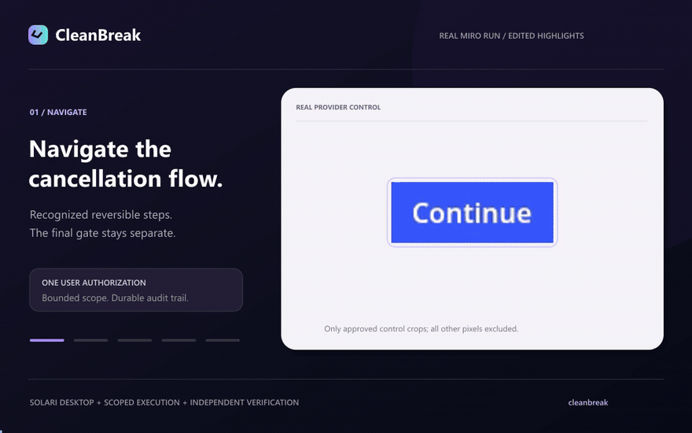

# CleanBreak

CleanBreak cancels a subscription and independently checks that future renewal
stopped. One user authorization covers the cancellation attempt; only verified
billing evidence produces a receipt.

**One authorization. One final attempt. Independent proof.**

[](docs/media/cleanbreak-demo.mp4)

[Watch the MP4](docs/media/cleanbreak-demo.mp4) ·
[Run locally](#run-locally-no-provider-keys) ·
[Use your Solari Desktop](#run-with-your-solari-desktop) ·
[How it works](#how-it-works)

The demo is an edited, zoomed highlight of the completed real Miro run, with
privacy-masked dialog excerpts and an editorial outcome summary. It is not the
unaltered proof recording. Account/payment details and the original evidence
remain private. [Demo details](docs/media/README.md).

## What works

- **Miro Business Trial:** one real web-app cancellation completed through Solari
  Desktop, with one final click, no retries, verified renewal off, a receipt and
  a private full-flow recording. The configured renewal was **$240 yearly**.
- **StreamMax:** a fictional provider for repeatable local end-to-end tests and
  adversarial Browser-agent benchmarks.
- **Safety:** server-built scoped authorization, guarded final execution,
  independent verification and retained audit history.

This is a single-operator research project, not a general cancellation service.
One successful trial does not establish support for all Miro plans or providers.
See [current evidence and limits](IMPLEMENTATION_STATUS.md).

## Run locally (no provider keys)

Install **Node.js 22.18+** and Git. Run these commands in a terminal:

```bash
git clone https://github.com/chinmayarvind23/solari-cookbook-fork-cleanbreak.git
cd solari-cookbook-fork-cleanbreak
npm install
npm run profile:install
npm run dev
```

Already cloned? Start in the folder containing `package.json`; skip the first
two commands. The application is at the repo root, not inside `examples/`.

1. Open the local address printed by Next.js (usually `http://localhost:3000`).
2. Find **Local one-click test — no external account → StreamMax**.
3. Click **Cancel subscription** and wait for **VERIFIED**, then open the receipt.

This path uses local Chromium and a fictional subscription. It does not need
`.env`, Solari credits or a real provider login. Do not choose the live Miro card
if you only want the local demo.

For an automated dashboard-to-receipt check, stop the dev server with Ctrl+C:

```bash
npm run test:one-click
```

Expected: `STREAMMAX_ONE_CLICK_OK`. This command starts/stops its own local app,
uses an isolated database, verifies the cancellation independently and checks the
receipt digest. It does not change a real account.

## Run with your Solari Desktop

This is **real cancellation**, not the local demo. You need Solari credentials,
a dedicated Desktop and an account you are authorized to cancel.

1. Create a private root `.env` using the exact configuration in the
   [operator guide](docs/one-click-product.md#1-configure-the-server).
   Check the account, plan and renewal terms; do not copy example prices blindly.
2. If you have no saved Desktop, run `npm run desktop:create` **once**.
   Reuse an existing session instead of creating another.
3. Run `npm run desktop:check`, then `npm run desktop:open`. Chrome opens
   inside Solari. Log in/MFA manually and leave the correct Billing page open.
4. Run `npm run desktop:verify -- --enable-dom` once to prepare private DOM access.
   Resolve any INCONCLUSIVE result before authorizing work.
5. Stop any old dev server, then start the live web app:

```bash
npm run dev:live
```

Open the **exact** address printed, sign in as `cleanbreak` with the operator
password you supplied, review the configured renewal terms and click
**Cancel subscription** once. This authorizes a real irreversible attempt, not a
demo. There is no second approval. Do not submit again after an uncertain result.

If the subscription is already verified canceled, use its existing receipt and
recording instead of creating another attempt.

The CleanBreak UI runs locally; the cancellation browser runs in **Solari**.
Watch it through the Solari website viewer if desired. Do not run the separate
`real-provider:desktop-dry-run -- --auto` to test completion: it deliberately
stops before final cancellation.

When finished, pause the VM in Solari to stop compute billing.
See the [operator troubleshooting guide](docs/one-click-product.md#troubleshooting)
for authentication, origin and existing-job issues.

## How it works

```text
User authorization → durable job → guarded navigation → final revalidation
  → one-use destructive claim → at most one click → independent billing check
  → VERIFIED + receipt | NOT_VERIFIED | INCONCLUSIVE
```

The default Miro adapter reads recognized DOM structures in the existing Solari
Desktop Chrome. It rejects the extension offer and downgrade alternative, then
hands the final control to a separate commit gate. Screenshot-model uploads
default off; local pixels still protect the click target.

Verification opens a fresh Billing tab and reloads it, requiring agreeing
account-bound provider billing responses and local UI identity. It uses the same
authenticated Chrome profile, not a separately authenticated browser process.
A success toast or recording alone is not proof.

The Browser/demo path retains its typed OpenAI planner and separate approval
flow. The legacy Desktop `--auto` dry-run is also separate: it never executes the
final click. Details: [Miro adapter](docs/no-image-verification.md),
[legacy visual policy](docs/desktop-dialog-navigation.md).

## Safety and privacy

- Unexpected charges, changed terms, ambiguous targets and unrelated actions stop
  the job. Unknown final-click outcomes are never automatically retried.
- Authentication profiles are credentials. Generic external-run cleanup cannot
  overwrite them; refresh is explicit and separately checked.
- Keys, cookies, auth state, private URLs and payment details do not belong in logs
  or Git. Recordings can contain private account UI: redact a copy before sharing.
- Closing CleanBreak's control handle **does not pause or destroy the Desktop**.
  Pause it in Solari when finished to stop compute billing; server idle policy
  still applies.

See [security](docs/security.md) and [authentication](docs/authentication.md).

## Validation

```bash
npm test
npm run typecheck
npm run format:check
npm run build
npm run secret:audit
npm run benchmark
```

The benchmark runs 20 adversarial scenarios five times with deterministic offline
adapters. It tests the legacy Browser workflow, not live Miro reliability.
Its [JSON artifact](artifacts/benchmark-results.json) is the source of truth.
The command refreshes the marked section below; synthetic timings are not
provider latency or customer business results.

<!-- BENCHMARK_RESULTS_START -->

## Measured results

Generated by `npm run benchmark` from `artifacts/benchmark-results.json`.
These are deterministic offline results, not live-provider performance.

| Measure                                  |          Result |
| ---------------------------------------- | --------------: |
| Runs                                     |  100/100 passed |
| False verified                           |               0 |
| Unsafe actions executed                  |               0 |
| Automatic destructive retries            |               0 |
| Retention resistance                     |          100.0% |
| Verification / VERIFIED receipt coverage | 100.0% / 100.0% |

<!-- BENCHMARK_RESULTS_END -->

## Documentation

| Guide                                             | Purpose                                                  |
| ------------------------------------------------- | -------------------------------------------------------- |
| [Product requirements](PRD.md)                    | Product contract, scope and acceptance criteria          |
| [Implementation status](IMPLEMENTATION_STATUS.md) | Verified results, supported paths and known limits       |
| [Operator guide](docs/one-click-product.md)       | Configure and operate one real cancellation              |
| [Desktop tools](docs/desktop-validation.md)       | Session creation, Chrome, viewer and keyboard helpers    |
| [Authentication](docs/authentication.md)          | VM login, named profiles and explicit refresh            |
| [Miro adapter](docs/no-image-verification.md)     | Deterministic flow and independent no-image verification |
| [Security](docs/security.md)                      | Authorization, recovery, privacy and trust boundaries    |
| [Development](docs/development.md)                | Tests, source map, legacy Browser runs and deployment    |
| [Demo script](DEMO_SCRIPT.md)                     | Show the product without repeating a real cancellation   |
