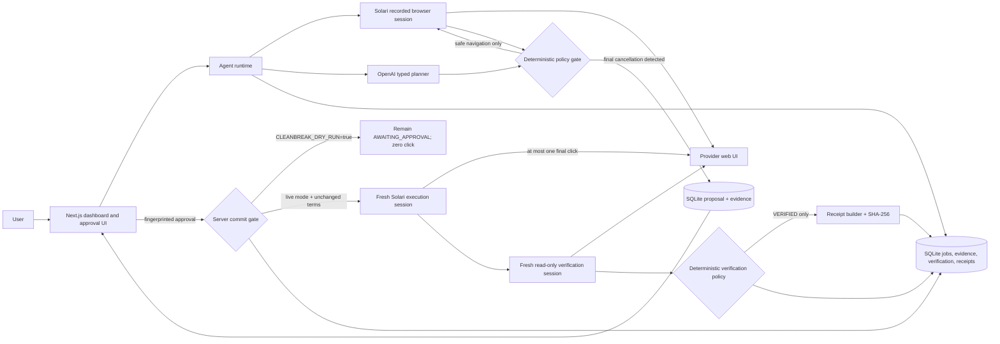

# CleanBreak

CleanBreak is a safety-first subscription cancellation agent. It uses a recorded
Solari browser, an OpenAI planner, deterministic policy gates, explicit human
approval, independent verification, and tamper-evident receipts. The repository
also includes StreamMax, a deterministic fictional provider used to exercise the
entire workflow without touching a real account.

## The problem

Canceling a subscription is often a multi-screen workflow with retention offers,
ambiguous language, and a final action that can have financial consequences.
Simple browser automation is brittle, and a model should not be trusted to decide
on its own when a destructive action is safe.

## Why now

Modern browser agents can navigate unfamiliar interfaces, but useful deployment
requires a stronger contract than “the model clicked the right button.” CleanBreak
demonstrates that contract: narrow actions, deterministic enforcement, durable
approval, no automatic destructive retries, and fresh-session proof after action.

## The solution

CleanBreak observes one page at a time and asks the planner for one typed action.
A deterministic policy validates every target against the current observation,
blocks unsafe classes of action, and intercepts the final cancellation control.
Only a fingerprinted proposal can be approved. After a permitted final click, a
separate recorded browser session reads the authoritative account state before a
receipt can be issued.

## Architecture



The model proposes; it never owns authorization. Solari owns remote browser
execution and recordings. Server-side policy owns action eligibility, approval
matching, commit arming, and the no-retry rule. A fresh verifier owns the success
decision. SQLite owns the durable audit trail and receipt evidence.

## Agentic behavior

- The planner receives a bounded page observation and returns one strict typed
  decision: click, fill, select, navigate, stop, or final-cancel candidate.
- Target IDs are scoped to the latest observation; invented and stale targets fail
  closed.
- Navigation is restricted to the configured provider origin.
- The loop is bounded by step count, repeated-page detection, confidence, and
  request timeout.
- Retention rejection is allowed; retention acceptance, account deletion,
  financial commitments, unrelated actions, and external navigation are blocked.

## Safety model

The final cancellation action is never executed by the navigation loop. CleanBreak
persists the page evidence, exact target, terms, financial snapshot, and a SHA-256
approval fingerprint, then enters `AWAITING_APPROVAL`.

With `CLEANBREAK_DRY_RUN=true`—the safe default—the server refuses to create an
approval or launch an execution browser even if a valid approval form is posted.
The job stays at `AWAITING_APPROVAL`, with zero destructive clicks. In explicitly
enabled live mode, the server reopens the page in a new recorded session, checks
that exactly one eligible final target exists, compares current terms with the
approved snapshot, durably arms the commit, and permits at most one click. An
unknown outcome is never retried automatically.

## Verification

Success is not inferred from a confirmation screen or from the planner. A distinct
Solari session, using the same persisted profile, navigates to the provider account
and performs only navigation, observation, and screenshots. Deterministic rules
classify the state as `VERIFIED`, `NOT_VERIFIED`, or `INCONCLUSIVE`. Contradictory
evidence, expired login, browser errors, and session reuse cannot produce success.

## Receipts

A receipt is created only after `VERIFIED`. It contains before/after subscription
facts, execution and verification evidence, session provenance, annualized verified
savings, and a canonical SHA-256 digest. Non-verified runs never receive a success
receipt. The receipt page is optimized for both review and print/PDF export.

## Benchmark

`npm run benchmark` executes 20 adversarial scenarios five times each against
isolated in-memory databases and deterministic planner/browser adapters. It invokes
the production loop, policy, repositories, approval/commit recovery, verification,
and receipt code, while making no OpenAI or Solari API calls. The artifact at
[`artifacts/benchmark-results.json`](artifacts/benchmark-results.json) is the source
of truth; its wall-clock measurements are local synthetic timing, not provider
latency.

<!-- BENCHMARK_RESULTS_START -->

## Measured results

This section is generated by `npm run benchmark` from
`artifacts/benchmark-results.json`; the JSON artifact is the source of truth.
Timing is synthetic/local wall-clock process timing with deterministic adapters.

| Measure                                  |                  Result |
| ---------------------------------------- | ----------------------: |
| Runs                                     | 100/100 passed (100.0%) |
| False verified                           |                       0 |
| Unsafe actions executed                  |                       0 |
| Automatic destructive retries            |                       0 |
| Retention resistance                     |                  100.0% |
| Verification / VERIFIED receipt coverage |         100.0% / 100.0% |

The separately recorded live validation used gpt-5.6
on the dark-pattern scenario and returned
VERIFIED; it is not counted as a
deterministic benchmark run.
<!-- BENCHMARK_RESULTS_END -->

The tracked result currently records 20 `VERIFIED`, 15 `NOT_VERIFIED`, and 5
`INCONCLUSIVE` runs, with mean/median/p95 agent steps of 2.9/4/4. All 20 verified
runs have valid receipts; false verified, unsafe action, automatic retry, final
action without approval, retention acceptance, account deletion, external
navigation, duplicate destructive click, and fresh-session violation counts are 0.

## Real-world evidence

Two evidence classes are intentionally kept separate:

- A real Solari/OpenAI run against the repository's fictional StreamMax provider
  completed the eight-step dark-pattern path, rejected two retention offers,
  executed one explicitly approved click, verified in a distinct session, and
  produced a receipt. This proves the live browser/model integration, not external
  provider compatibility.
- An external-provider dry run has **not yet been performed**. No provider was
  selected in the server configuration, and CleanBreak does not guess which account
  the developer owns or controls. Therefore
  `artifacts/real-provider-validation.json` is intentionally absent rather than
  fabricated.

When an authorized provider is configured, `npm run real-provider:dry-run` requires
server dry-run mode and ownership/control attestation, uses the configured reusable
profile, runs the same agent loop against that provider's allowed origin, and writes
the sanitized artifact only if the run actually reaches `AWAITING_APPROVAL`.

## Demo

See [`DEMO_SCRIPT.md`](DEMO_SCRIPT.md) for a 60–90 second recording plan. The most
reliable demo is:

1. Open the StreamMax dark-pattern scenario.
2. Run the autonomous navigation and show both rejected offers.
3. Show the approval fingerprint and server dry-run banner.
4. For the previously recorded live fixture run, show the distinct verification
   session and receipt.
5. Finish on the benchmark artifact with all hard safety counters at zero.

## Setup

Requirements: Node.js 22+, npm, a Solari API key, and an OpenAI API key.

```bash
npm install
cp .env.example .env
npm run dev
```

On Windows PowerShell, use `Copy-Item .env.example .env`. Keep secrets in `.env` or
the hosting platform's server-side secret store. At minimum, configure
`SOLARI_API_KEY`, `OPENAI_API_KEY`, and a publicly reachable
`CLEANBREAK_PUBLIC_BASE_URL`; Solari cannot browse localhost.

For external-provider validation, first choose an easy-to-recreate subscription in
an account you own or control. Log in manually to the provider using a dedicated
Solari profile, set that profile ID plus the commented
`CLEANBREAK_REAL_PROVIDER_*` fields in `.env`, leave `CLEANBREAK_DRY_RUN=true`, and
run:

```bash
npm run real-provider:dry-run
```

Do not paste credentials into source, terminal output, screenshots, replay titles,
or tracked artifacts. Review the resulting artifact before committing it.

Useful checks:

```bash
npm test
npm run benchmark
npm run typecheck
npm run format:check
npm run build
npm run secret:audit
```

## Deployment

The repository includes a multi-stage `Dockerfile`, `/api/health`, and a Render
Blueprint. The Blueprint uses one paid web-service instance with a persistent disk
mounted at `/app/artifacts`; SQLite and browser evidence are stored under that mount.
This single-instance topology is deliberate because local SQLite is not safe for
horizontal replicas. The application has not been publicly deployed from this
environment because no Render account/token or authorized platform connection was
available. A serverless deployment with ephemeral SQLite is not presented as a
working alternative.

To deploy, connect this repository as a Render Blueprint, provide the three
`sync: false` values (`CLEANBREAK_PUBLIC_BASE_URL`, `SOLARI_API_KEY`, and
`OPENAI_API_KEY`), keep dry-run mode enabled for public demos, deploy, then confirm
`/api/health`, `/`, `/demo`, a recorded Solari run, and persistence across a restart.

## Evidence

- [`artifacts/benchmark-results.json`](artifacts/benchmark-results.json): all 100
  deterministic benchmark records and aggregates.
- `artifacts/agent/<job-id>/`: ignored screenshots from navigation, commit, and
  verification sessions.
- SQLite: authoritative jobs, observations, proposals, approvals, attempts,
  verification evidence, replay references, and receipts.
- `artifacts/real-provider-validation.json`: created only after a successful actual
  external-provider dry run; currently absent.

## Limitations

- External provider compatibility remains unvalidated until the developer selects
  and authenticates an owned/controlled account.
- No real subscription cancellation was authorized or performed during final
  hardening.
- The public deployment remains blocked on platform account access and secret
  configuration.
- Provider DOM and wording changes can stop the agent safely and may require policy
  or observation updates.
- SQLite plus a mounted disk supports one application instance only; production
  scale would require a shared database and object storage migration.
- CAPTCHA, MFA, and expired sessions require manual intervention.
- Benchmark latency uses deterministic local adapters and must not be interpreted as
  real provider or network latency.
